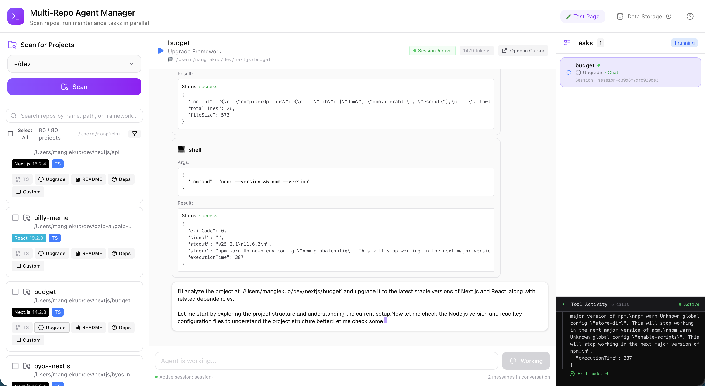

<div align="center">

# 🤖 Multi-Repo Agent Manager

**AI-Powered Repository Maintenance at Scale**

Manage and maintain multiple code repositories in parallel using autonomous AI agents powered by the Cursor SDK.

[](https://nextjs.org/)
[](https://react.dev/)
[](https://www.typescriptlang.org/)
[](https://tailwindcss.com/)
[](LICENSE)

</div>

---

## 🚧 Experimental Hackathon Project

> **Built at [Build with Cursor London](https://www.cursor.com/events) (Dec 9, 2024)**

This is a **hackathon-style experimental project** built on top of **[@cursor-ai/january](https://www.npmjs.com/package/@cursor-ai/january)**, an alpha-stage Node.js SDK that brings Cursor's AI agent capabilities outside of the IDE.

### ⚠️ Important Limitations

- **Non-Production Alpha Feature**: `@cursor-ai/january` is in early alpha and not production-ready
- **Requires Alpha Access**: You need to be enrolled in Cursor's alpha program to use this SDK
- **API Key Required**: Obtain from [https://cursor.com/dashboard?tab=integrations](https://cursor.com/dashboard?tab=integrations)
- **API Instability**: The SDK API can change at any time without notice
- **Reliability**: Expect bugs, breaking changes, and potential instability
- **No Official Support**: This is an experimental showcase, not a production tool

### What is @cursor-ai/january?

A Node.js SDK that enables Cursor's agent capabilities without the IDE interface:
- **Repository Analysis**: Read and understand codebases
- **Cursor Rules Support**: Respect `.cursor/rules/*.mdc` and workspace configurations
- **Tool Execution**: Web search, CLI commands, file operations
- **Agent Autonomy**: Multi-step reasoning and task execution

⚠️ not for production use cases.

---



## ⚠️ Important Security Notice

**This application is designed for LOCAL USE ONLY. Download and run on your local machine. Use at your own risk.**

- AI agents have **file system access** to modify code in your repositories
- Your terminal/IDE will **prompt for home folder access** when you run `pnpm run dev`
- By default, agents can access your **entire home directory** (`~/Users/username` on Mac, `C:\Users\username` on Windows)
- **Only use on repositories you trust** and are comfortable letting AI modify
- **Always use version control** (git) so you can review and revert changes

### 🔒 Restricting Agent Access to a Specific Folder

If you prefer to limit agent access to a specific folder instead of your entire home directory:

1. Open `app/api/agent/route.ts`
2. Find the line with the comment: `// Gets ~/Users/username on Mac, C:\Users\username on Windows`
3. Update it to use your preferred directory path (e.g., `~/dev/safe-projects`)

**Note:** This restriction applies only to where *agents* can work. The frontend scanner UI will still allow you to browse and scan any user-specified path.

---

## 🌟 Features

- **🔍 Repository Scanner**: Automatically discover Node.js/JavaScript projects in any directory
- **⚡ Parallel Agent Execution**: Run multiple AI agents simultaneously across different repositories
- **🎯 Pre-built Actions**: TypeScript migration, framework upgrades, documentation generation, dependency updates, custom prompts
- **💾 JSON Persistence**: All tasks and chat history saved locally (`~/.cursor-sdk-manager/tasks.json`)
- **🔄 Multi-turn Conversations**: Continue conversations with agents across sessions
- **📡 Real-time Streaming**: Watch agent thinking and actions live


---

## 🚀 Getting Started

### Prerequisites

- **Node.js** 18 or higher ([Download](https://nodejs.org/))
- **pnpm** package manager ([Install](https://pnpm.io/installation))
- **Cursor API Key** from [app.cursor.sh](https://app.cursor.sh/settings)

### Installation

1. **Clone and install:**

```bash
git clone https://github.com/ghcpuman902/cursor-sdk-js-2-ts.git
cd cursor-sdk-js-2-ts
pnpm install
```

2. **Configure API key:**

Create a `.env.local` file:

```bash
echo "CURSOR_API_KEY=your_api_key_here" > .env.local
```

Get your API key from [https://app.cursor.sh/settings](https://app.cursor.sh/settings)

3. **Run the app:**

```bash
pnpm run dev
```

4. **Grant permissions:**

When prompted by your terminal or IDE, grant access to your home folder (or see security notice above to restrict access).

5. **Open browser:**

Navigate to [http://localhost:3088](http://localhost:3088)

---

## 💡 Usage

### 1. Scan for Repositories

- Select a root directory (e.g., `~/dev`, `~/projects`, or custom path)
- Click "Scan" to discover all Node.js/JavaScript projects
- View detected projects with framework badges and TypeScript indicators

### 2. Run Actions

Choose from 5 pre-built actions for any repository:

| Action | Description |
|--------|-------------|
| **🔄 Upgrade to TypeScript** | Convert JavaScript projects to TypeScript |
| **⬆️ Upgrade Framework** | Update Next.js, React, Vue, etc. to latest version |
| **📝 Summarize Codebase** | Generate comprehensive README.md |
| **📦 Update Dependencies** | Upgrade outdated packages |
| **✨ Custom Prompt** | Run any custom maintenance task |

### 3. Monitor Progress

- View real-time agent output in the center panel
- Switch between multiple running tasks using tabs in the sidebar
- See thinking process, tool calls, and responses
- Track token usage and completion status

---

## 🏗️ Tech Stack

- **Next.js 16** - React framework with App Router
- **React 19** - UI library with server components
- **TypeScript 5** - Type safety
- **Tailwind CSS 4** - Modern styling
- **@cursor-ai/january** - Cursor Agent SDK
- **JSON Storage** - Lightweight file-based persistence
- **Shadcn UI** - Beautiful component library

---

## 🔧 API Endpoints

- `POST /api/scan-repos` - Scan directory for repositories
- `POST /api/agent` - Create/run Cursor agent with SSE streaming
- `GET /api/tasks` - Load all persisted tasks
- `POST /api/tasks/save` - Save or update a task
- `DELETE /api/tasks/:id` - Delete a specific task

---

## 📊 Data Persistence

All task data is stored as **JSON files** in `~/.cursor-sdk-manager/`:
- `tasks.json` - Agent tasks with messages and tool calls
- `scanned-repos.json` - Cached repository scan results

**What's stored:**
- All agent tasks (status, timestamps, metadata)
- Complete chat history (messages, tool calls, thinking)
- Terminal output and activity logs
- Token usage statistics

**To reset data:**
```bash
rm ~/.cursor-sdk-manager/*.json
```

---

## 🎯 Use Cases

- Maintain multiple side projects simultaneously
- Migrate several repos to TypeScript in parallel
- Generate documentation for forgotten projects
- Keep dependencies up-to-date across your portfolio
- Run custom automation tasks on multiple codebases

---

## ❓ FAQ

**Q: Can I deploy this to Vercel/production?**  
A: No. This app is designed for local development only. Agents need write access to your local filesystem.

**Q: How much does it cost?**  
A: Costs depend on Cursor API usage. Token consumption varies by task complexity. Monitor usage in your Cursor dashboard.

**Q: Can agents modify my code?**  
A: Yes, agents have full file system access to the working directory. Always use git to track and review changes.

**Q: Can I run this on Windows?**  
A: Yes, but ensure Node.js and pnpm are installed. Some path handling may need adjustment.

**Q: How many agents can run simultaneously?**  
A: Technically unlimited, but 3-5 agents is recommended for best performance.

---

## 🤝 Contributing

Contributions are welcome! Please read [CONTRIBUTING.md](CONTRIBUTING.md) for guidelines.

---

## 📝 License

This project is licensed under the MIT License - see the [LICENSE](LICENSE) file for details.

---

## 🙏 Acknowledgments

- **[Cursor SDK](https://github.com/cursor-ai/january)** - The amazing SDK powering this project
- **[Next.js](https://nextjs.org/)** - The React framework
- **[Shadcn UI](https://ui.shadcn.com/)** - Beautiful UI components
- **[Tailwind CSS](https://tailwindcss.com/)** - Utility-first CSS framework

---

<div align="center">

Made with ❤️ by Mangle Kuo

⭐ **Star this repo** if you find it useful!

</div>
